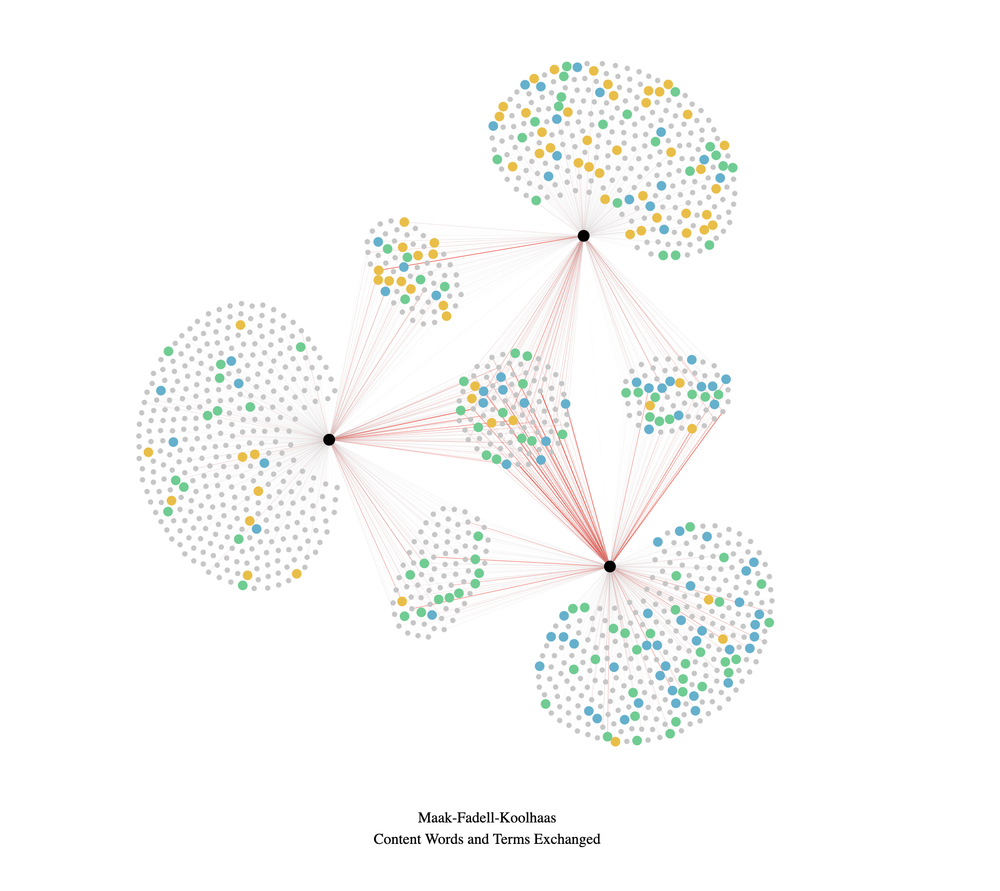

# CMU Interactive Data Science Final Project
**Project title**: Tracing Interdisciplinary Design Conversations

* **Online URL**: https://cmu-ids-2020.github.io/fp_hu_giesa_erdolu/
* **Team members**:
  * Contact person: kigesa@andrew.cmu.edu
  * eerdolu@andrew.cmu.edu
  * meijieh@andrew.cmu.edu
* **Track**: Narrative
* **Link to video demo**: https://drive.google.com/drive/folders/18pRqbyy4Dg9TUiT8VgUD3CHqKHcBQw3w
  * For the best resolution, please switch to 1080HD or watch the video in full screen mode.
* **Running Instructions**:
  * Click the online URL above and start navigating the interactive narrative.
  * We recommend 50% or 67% zoomed out view on a Chrome browser.
  * You will find tips on how to interact with the visualizations. 
  
 

## Abstract

## Work distribution

Update towards the end of the project.

## Deliverables

### Proposal

- [ ] The URL at the top of this readme needs to point to your application online. It should also list the names of the team members.
- [ ] A completed proposal. The contact should submit it as a PDF on Canvas.

### Design review

- [ ] Develop a prototype of your project.
- [ ] Create a 5 minute video to demonstrate your project and lists any question you have for the course staff. The contact should submit the video on Canvas.

### Final deliverables

- [ ] All code for the project should be in the repo.
- [ ] A 5 minute video demonstration.
- [ ] Update Readme according to Canvas instructions.
- [ ] A detailed project report. The contact should submit the video and report as a PDF on Canvas.
